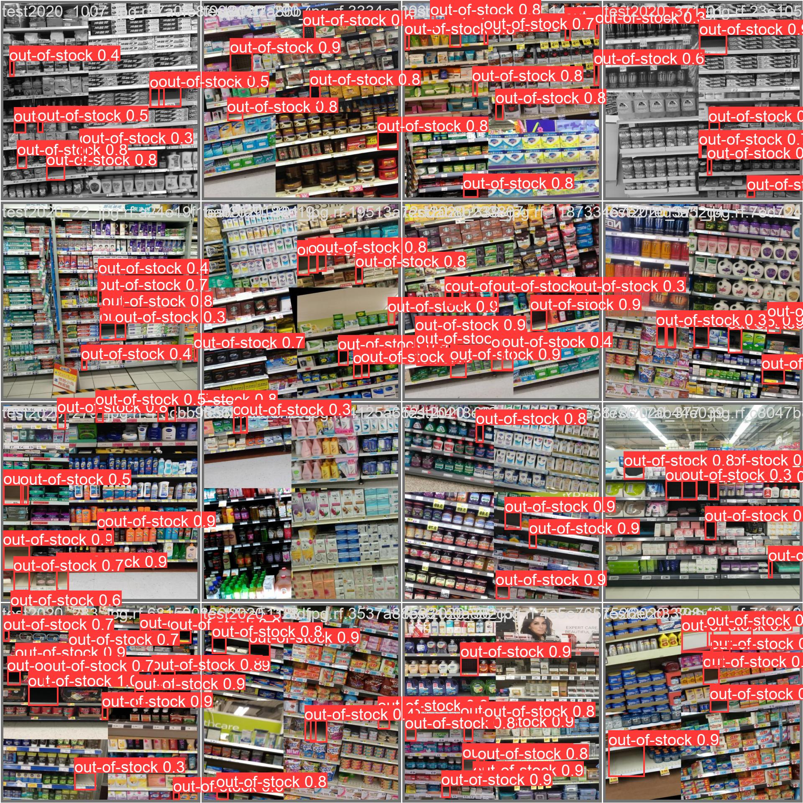

# YOLOv8 Object Detection: Empty Shelf Detection

## Overview

This repository contains scripts for training and predicting with YOLOv8, specifically tailored for detecting empty shelves in retail environments. YOLOv8 (You Only Look Once, version 8) is a state-of-the-art, real-time object detection system that improves accuracy and performance over its predecessors.

### Files Description

- `predict.py`: Script for performing object detection on a given image. It loads a pre-trained YOLOv8 model and outputs the detection results.
- `train.py`: Script for training a YOLOv8 model on a custom dataset. It includes integration with Weights & Biases (wandb) for experiment tracking.

## Installation

Before running the scripts, ensure that you have the necessary libraries installed.

```bash
pip install ultralytics
pip install wandb
pip install Pillow
```

## Usage

### Training a Model

To train a model, run:

```bash
python train.py
```

Ensure that the Weights & Biases API key is set in your environment variables as `WANDB_API_KEY`.

### Running Predictions

To perform predictions using a trained model, run:

```bash
python predict.py --image_url path_to_your_image.jpg
```

Make sure to provide the correct path or URL to the image you want to analyze.

## Model Performance Overview

During training, the model demonstrated progressive improvements in key metrics:

- **Box Loss**: Decreased steadily, indicating improving accuracy in bounding box predictions.
- **Class Loss**: Also showed a decreasing trend, reflecting better classification of objects.
- **Precision and Recall**: Both metrics increased over epochs, demonstrating enhanced model reliability in detecting empty shelves.
- **Mean Average Precision (mAP)**: mAP for both 50% IoU (Intersection over Union) and 50-95% IoU ranges showed substantial growth, confirming the model's overall effectiveness.

These metrics were observed across multiple epochs for both training and validation datasets, underscoring the model's robustness and ability to generalize.

## Method Description

YOLOv8 continues the evolution of the YOLO family of object detection models. It offers enhanced accuracy and speed, making it suitable for real-time applications. YOLOv8 operates by dividing the input image into a grid and predicting bounding boxes and class probabilities for each grid cell. The key features of YOLOv8 include:

- **Real-Time Detection**: Designed to process images swiftly, enabling real-time detection capabilities.
- **Improved Accuracy**: Enhanced algorithms provide better detection accuracy compared to earlier versions.
- **Versatility**: Can be trained on custom datasets for various object detection tasks.

This implementation focuses on the detection of empty shelves, a critical aspect for retail inventory management. The model is trained on a specialized dataset to identify and locate empty shelf spaces, aiding in efficient restocking and inventory control.

Below is a sample of the model's predictions on batch of test images:


## Contributing

Contributions to this project are welcome. Please submit a pull request or open an issue for bugs, suggestions, or new features.
